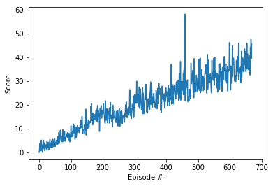

# Results report

## Selected hyperparameters
The following hyper parameters has been used for the experiment purpose:
|Name|Value|
|---|---:|
|Episodes|670|
|LR_ACTOR|2e-4|
|LR_CRITIC|2e-4|
|Tau|7e-3 |
|Buffer size|1e6|
|Batch size|128|
|Target|30.0|

## [DDPG](https://deepmind.com/research/publications/continuous-control-deep-reinforcement-learning/)

I have not tried many variations. I started with default setup of DDPG in the paper.It seems to work well as it gained my expected score of 30 in 670 episodes. 
Hence, I have not gone for different variations.
The network for actor and critic was 3 layer based. 2 fully connected layers with 64 units and the last layer with 4 units according to the observation space though for the critic the output size is 1.
For activation function Relu was used for the hidden layers but Tanh and relu was used for the output layer or actor and critic respectively. 
The structure of the network is: state -> fc layer 1 -> fc layer 2 -> output layer. In case of code implementation, I followed almost the same network from the exercises in the nano degree which is well explianed in the contents. 

## Result and Issues:
The plot or rewards for the given settings is givne below :

- The network seems to be very slow at the starting though it started to pick up in the later part.
- Using batch normalizati0n did not help that much in the model.

## Idea for future work:
- I think using policy gradient will a helpful thing as it will help in determining appropriate policy.
- Another idea can be to have a master and slaves networks where slaves will work individually and will send the update at the end of an episode and the master will then 
update or optimize the gradient. 
